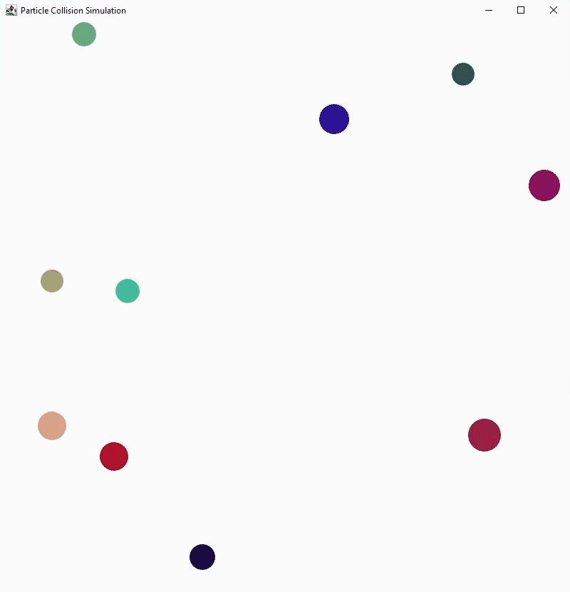

# Particle Collision Simulation

## Introduction

It is a particle collision simulation written in Java (Swing is used for GUI). It is time driven and based on discrete collision detection. The aim of this project is to handle elastic collisions using the conservation of momentum and kinetic energy. The simulation has 2 modes: Balls and Small Particles.

### Balls
Balls of random sizes and colors start at random locations and with random velocities and move in the panel.



### Small Particles
Small particles, which act like air molecules, are used.


## Configuration
```Java
public final static int width = 800; //Width of the panel.
public final static int height = 800; //Height of the panel.

private final static Mode mode = Mode.Balls; //Selected mode.

private final static int numberOfBalls = 10; //Used in Balls mode.
private final static int numberOfSmallParticles = 500; //Used in Small Particles mode.

private final static int dt = 16; //Time difference between each frame (in milliseconds).
```

## Details
Since the collisions in the simulation are designed to be elastic collisions, both momentum and kinetic energy is conserved. Using them, we can calculate final velocities of colliding particles.

We know that momentum is conserved. Hence, we can say:

m<sub>1</sub>v<sub>1</sub> + m<sub>2</sub>v<sub>2</sub> = m<sub>1</sub>v<sub>1</sub>’ + m<sub>2</sub>v<sub>2</sub>’

Since the kinetic energy is also conserved, we can say:

1/2 \* m<sub>1</sub>v<sub>1</sub><sup>2</sup> + 1/2 \* m<sub>2</sub>v<sub>2</sub><sup>2</sup> = 1/2 \* m<sub>1</sub>v<sub>1</sub>’<sup>2</sup> + 1/2 \* m<sub>2</sub>v<sub>2</sub>’<sup>2</sup>

Given that we know masses and initial velocities, we have 2 equations and 2 unknowns: final velocities of both particles. Consequently, we can derive formulas for each final velocity. There are commonly used formulas involving trigonometric functions. In addition, there is an article explaining another way to handle 2 dimensional elastic collisions using vectors, which I found more understandable compared to the other formulas. Therefore, I preferred this way.

The source is: https://imada.sdu.dk/~rolf/Edu/DM815/E10/2dcollisions.pdf

## Please Note

- The simulation is time driven. Therefore, it checks every pair of the particles in every frame. Hence, its time complexity is O(n^2) and when the simulation is run with a high number of particles, it may run slowly.

- The simulation is based on discrete collision detection. That is, it checks the collisions in every frame and therefore can miss some collisions. Furthermore, frames with overlapping particles might be rendered.

- I develop the simulation for my self-improvement, it is not designed to be completely realistic and therefore it can misbehave. Thus, it should not be trusted when accuracy is important.

- The simulation may not work properly. In any case of direct or indirect damage, loss etc., the developer will not be liable.